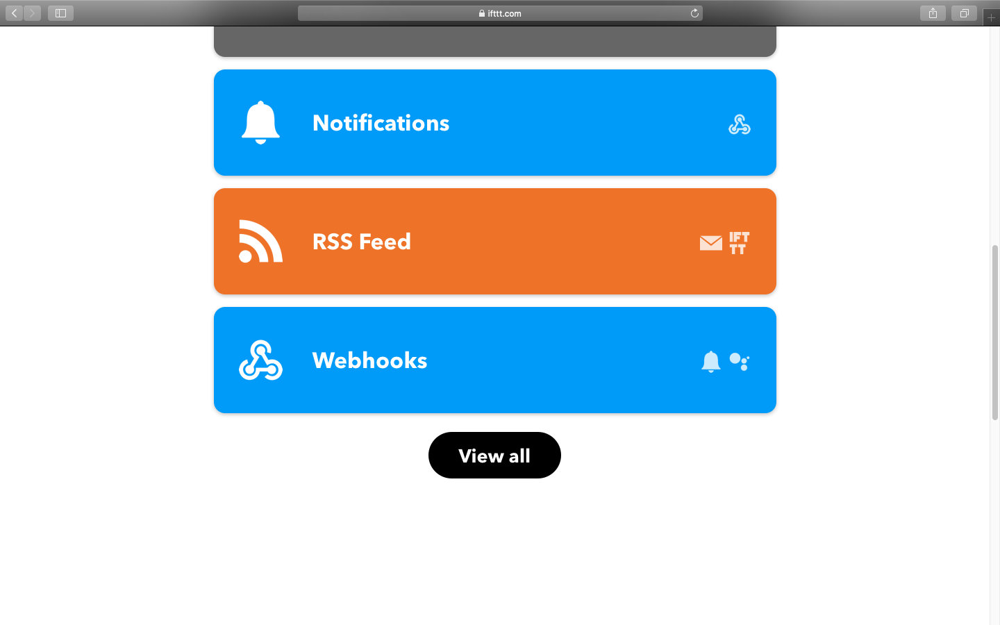
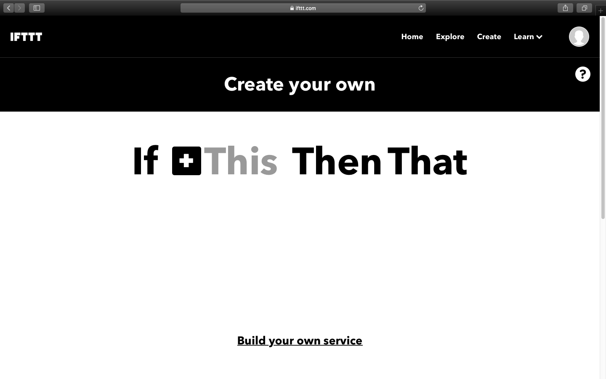

# Detector_Vazamento_Gas_Esp_IFTTT
Simples detector de vazamento de gás e aumento de temperatura que utiliza ESP-01 e envia um alerta pelo IFTTT

<h1 align="center">
    
</h1>

Passo a passo para configurar o IFTTT para envir o alerta para o celular. Primeiro entre no site oficial do IFTTT e crie uma conta. Baixe o app deles no celular também.

 
No site, depois de logar, selecione "Webhooks"

<h1 align="center">
    
</h1>

 
Clique no "+" depois do "if"

<h1 align="center">
    
</h1>
