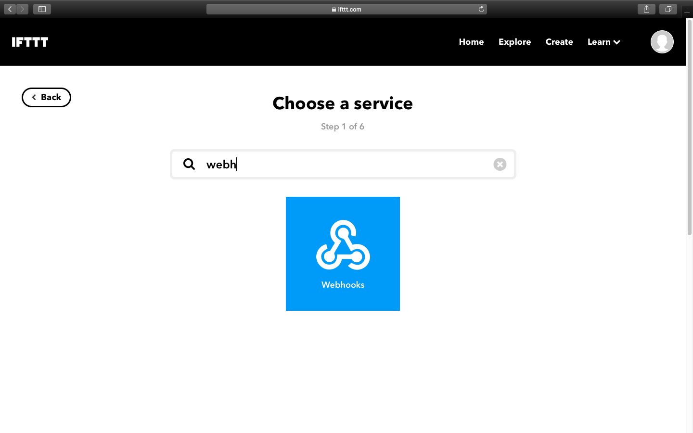
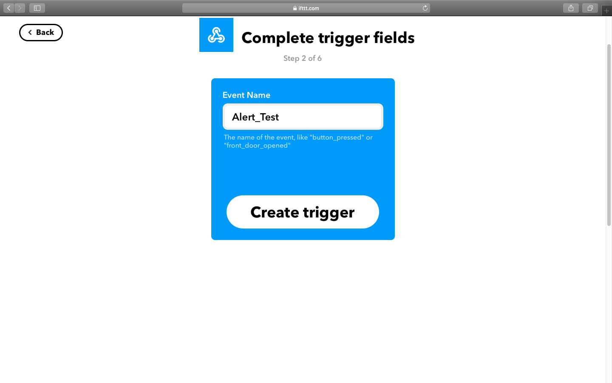
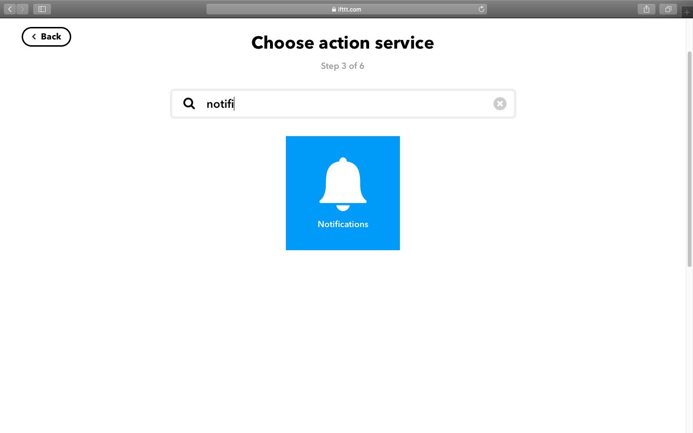
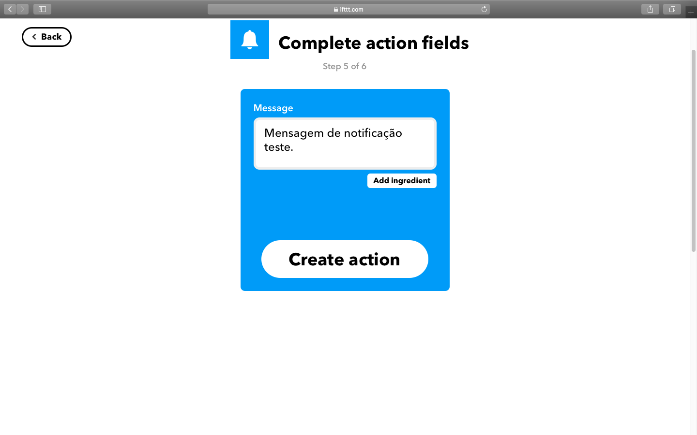

# Detector_Vazamento_Gas_Esp_IFTTT
Simples detector de vazamento de gás e aumento de temperatura que utiliza ESP-01 e envia um alerta pelo IFTTT

<h1 align="center">
    
</h1>

Passo a passo para configurar o IFTTT para envir o alerta para o celular. Primeiro entre no site oficial do IFTTT e crie uma conta. Baixe o app deles no celular também.

 
No site, depois de logar, selecione "Webhooks"
<h1 align="center">
    
</h1>

 
<h1 align="center">
    Clique no "+" depois do "if"
    
</h1>

 
<h1 align="center">
    Busque por "Webhooks" e selecione ele
    
</h1>

 
<h1 align="center">
    Escreva um nome para o seu evento
    
</h1>

 
<h1 align="center">
    Depois clique no outro "+" e busque por "Notifictions"
    
</h1>

 
<h1 align="center">
    Escreve a mensagem que você queira que mostre na notificação do celular.
    
</h1>

 
Por fim, vá para Home, Webhooks, e clique em Documentations. Lá terá a sua "key" que deverá ser adcionada no código do ESP-01.

 
Feito com ♥ por André Oliveira Cunha :wave: [Linkedin](https://www.linkedin.com/in/andr%C3%A9-oliveira-cunha-b26b3a156/)
